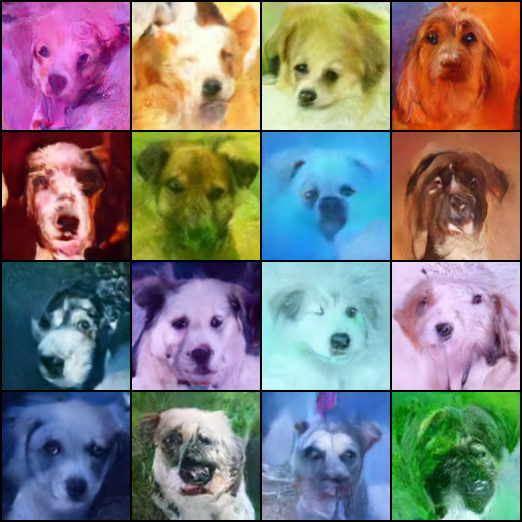
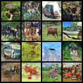

# Simple Diffusion Model Practice 

This repo contains some simple practices for training diffusion models. There are multiple examples under `scripts` folder.

You can also use this as a module for constructing your own diffusion model training pipeline. The `scripts` folder contains some examples for training diffusion models.
This is very easy to migrate to other datasets and models. 

### Config accelerate Options  

to config the training parameters : 
```shell
accelerate config 
```
### Train Configuration Options

You can customize training behavior via `TrainConfigs`:

```python
config = TrainConfigs(
    max_epoch=100,
    train_batch_size=64,
    gradient_accumulation_steps=2,  # Effective batch size = 64 * 2 = 128
    gradient_clipping=1.0,  # Set to None to disable
    mixed_precision="fp16",  # or "bf16" or None
    # ... other options
)
```

### Exm1: Fine-Tuned diffusion model on dog dataset 

- Model : "anton-l/ddpm-butterflies-128"
- Dataset : "huggan/few-shot-dog" (This dataset contains 389 images of dogs, 90% for training and 10% for validation)
- Train on resolution 128

If you want to get the pretrained model for this, go to [hugging face model](https://huggingface.co/FriedParrot/ddpm-few-shot-dog-128)

to launch this training : 
```shell
accelerate launch -m scripts.dogs.train_shot_dog
```

generated examples : 


### Exm2: Train a diffusion model on cifar10 dataset

- Model : use `google/ddpm-cifar10-32` as the model.  (We load it without the pretrained weights, so the model is trained from scratch)
- Dataset : "cifar10" (This dataset contains 60000 images of 10 classes, 50000 for training and 10000 for validation)
- Train on resolution 32

to launch this training : 
```shell
accelerate launch -m scripts.cifar10.train_cifar10
```

The generated examples after 50 epochs :


Note this is not so good, but you may increase `reverse_diffusion_steps`. The default is 100, you can set it to 2000 or more for better results.
