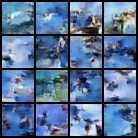
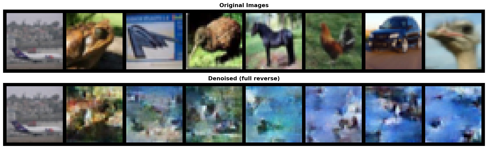

# Simple Diffusion Model Practice 

This repo load the cifar10 dataset, and use `google/ddpm-cifar10-32` as the model.
We load it without the pretrained weights, and train it from scratch.

to config the training parameters : 
```shell
accelerate config 
```

to launch the training  
```shell
accelerate launch unconditional.py 
```

That's what it is at start : 




And that's what it is at the end :
